# APITestGuide
手把手教会你做API自动化测试，你需要有一点点扣腚经验，至少保证能准确的ctrl+c ctrl+v

## 环境配置
- 下载安装
  * [Postman](https://www.getpostman.com/downloads/)
  * [Node.js](https://nodejs.org/en/)

- 命令行安装
  * newman
  ```
  npm install -g newman
  ```

  * newman-html-report
  ```
  npm install -g newman-reporter-html
  ```

  * jsonserver(非必须，本教程用做API服务器的mock，用法很多，自行[参考](https://github.com/typicode/json-server)
)
  ```
  npm install -g json-server
  ```

- 本教程用到的相关软件的版本
* Postman v7.0.9
* Node v10.15.2
* npm v6.4.1
* newman v4.4.1
* json-server v0.14.2

## 创建模拟被测环境
找到一个空目录(参考sample目录)，创建一个db.json的文件
```JSON
{
  "animals": [
  ]
}
```

启动模拟环境
```
json-server --watch db.json
```

## 教程说明
本教程会通过下面2个API请求，覆盖大部分用法
- 通过post请求创建一个动物
- 通过get请求获取创建完的动物

自动化测试的执行需要3个主要输入文件
- 测试用例
- 测试数据
- 环境配置

本教程会教会你怎么创建并使用这3个文件

当然，报告也是必不可少的，如何生成报告也会在本教程中被覆盖

## 使用postman进行手工测试
自动化测试只是把手工测试的步骤自动化执行，so第一步，我们先来手工做一遍

打开postman，创建一个collection
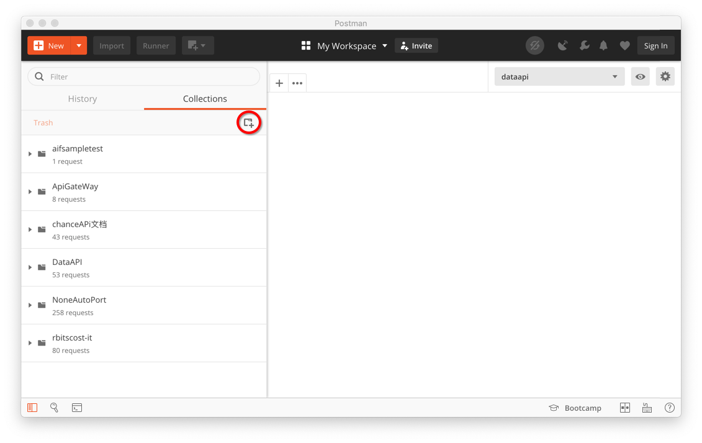
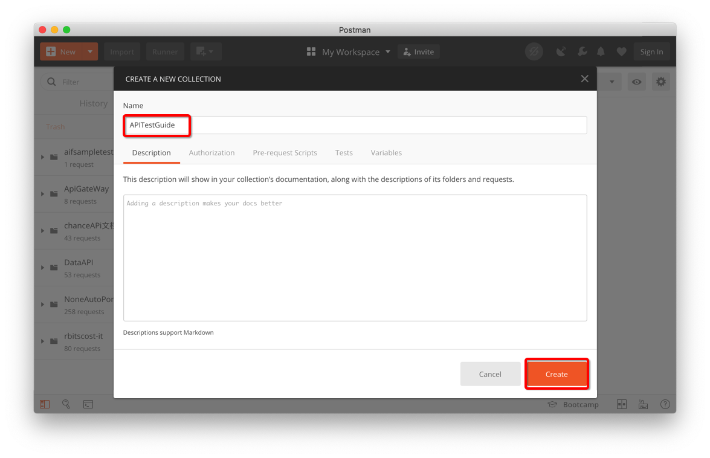

创建一个请求:通过post请求创建一个动物
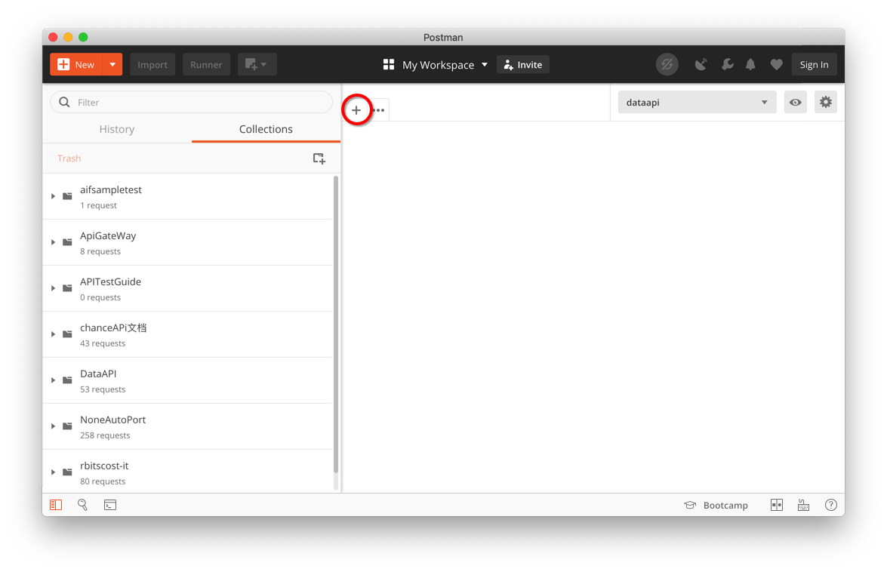
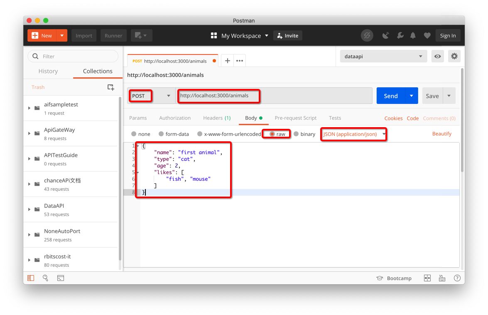

试一下
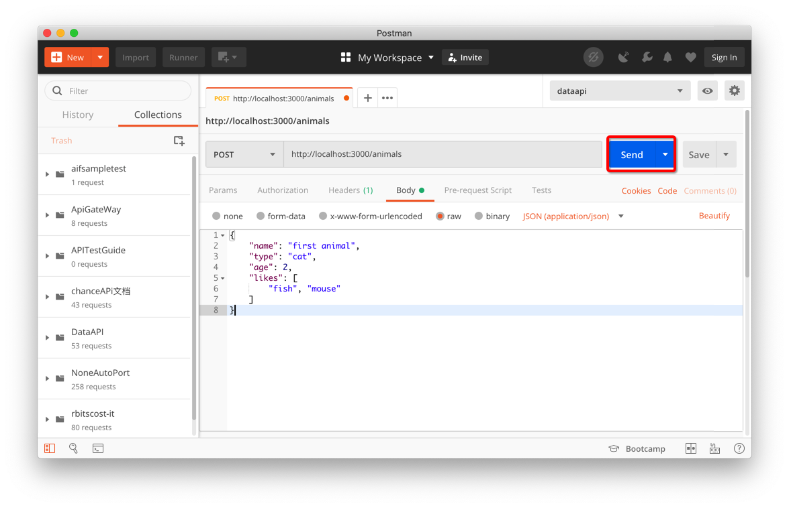

结果如下图，返回201，表示正常，创建完的数据也加上了id并放回
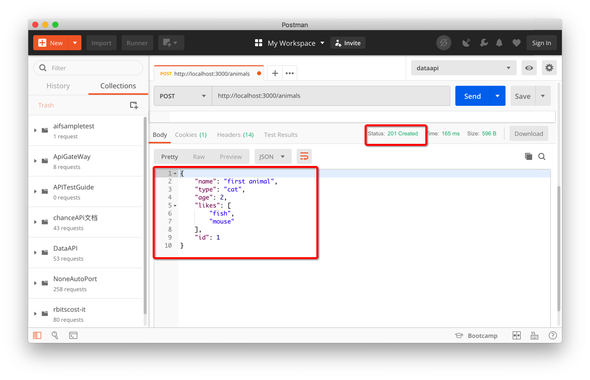

这个请求没啥问题，保存起来
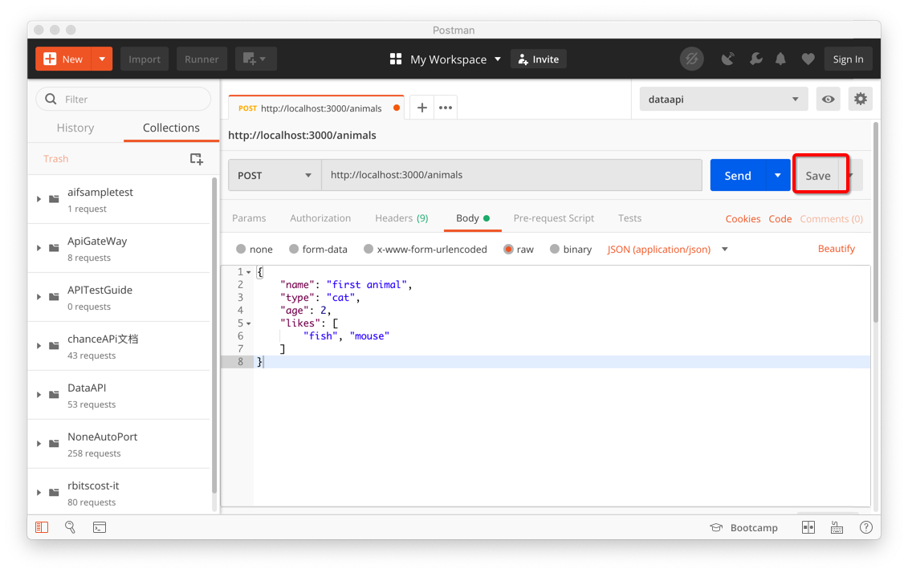
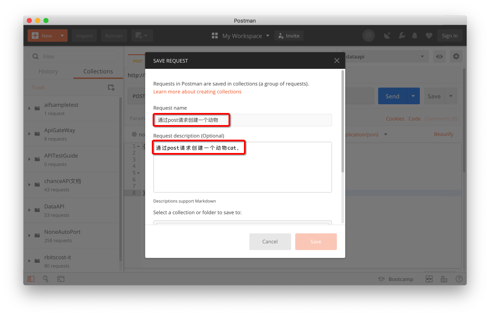
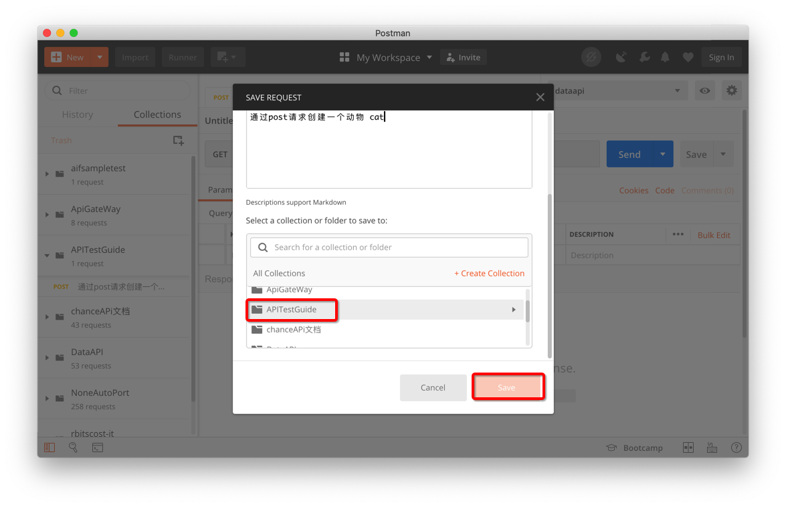

光发送请求是不够的，我们在增加一些验证，先对我们要做的验证做一点描述
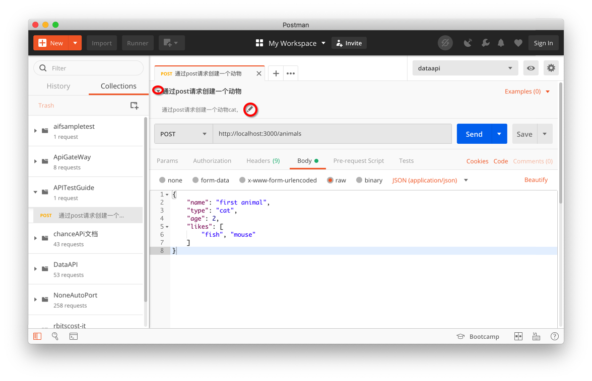
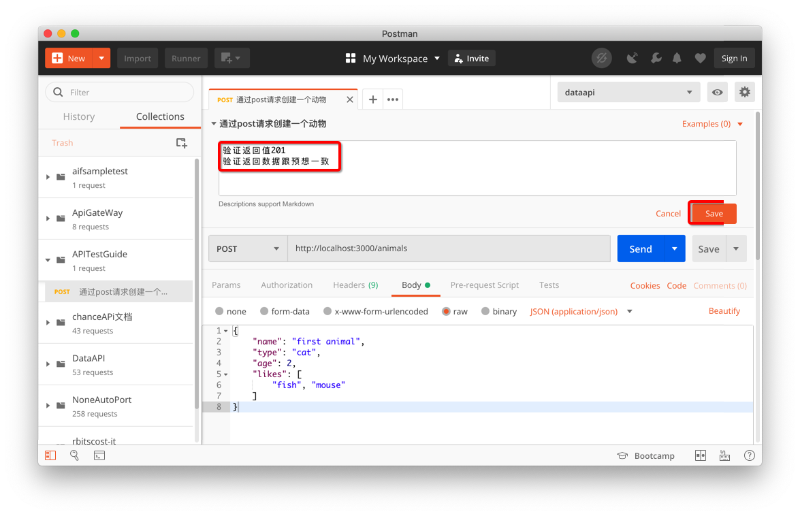

接下来增加验证的代码，验证我们用[chai的assert模块](https://www.chaijs.com/api/assert/)
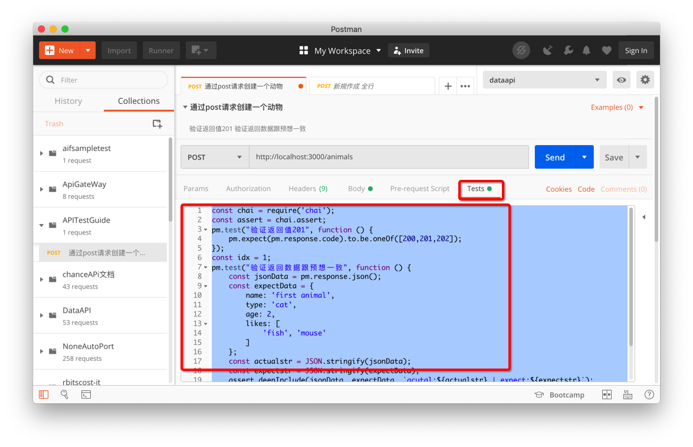
Tests框内的代码部分可以从下面黏贴，代码部分说明参考注释
```javascript
// 引入chai的assert模块作为验证用模块
const chai = require('chai');
const assert = chai.assert;
// 验证返回值，通常返回值可能有200，201，202，本例中3返回值为这3个中的一个即为pass，实际使用中可以按需修改
pm.test("验证返回值201", function () {
    pm.expect(pm.response.code).to.be.oneOf([200,201,202]);
});
// 验证返回值
pm.test("验证返回数据跟预想一致", function () {
  // 获取返回值
  const jsonData = pm.response.json();
  // 设置预想值
  const expectData = {
    name: 'first animal',
    type: 'cat',
    age: 2,
    likes: [
      'fish', 'mouse'
    ]
  };
  // 为方便后期排查，我们把预想值和实际值转换成string类型
  const actualstr = JSON.stringify(jsonData);
  const expectstr = JSON.stringify(expectData);
  // 比较预想值和实际值，当验证不通过事后输出参数3的字符串方便排查
  // 本例用的json结果的比较，jsonData里只需要包含所有的expectData即为通过，其他验证类型参考文档
  assert.deepInclude(jsonData, expectData, `acutal:${actualstr} | expect:${expectstr}`);
  // id为自增字段，每一次请求都不一定相同，为了后面使用，把返回值的id保留到全局变量newid
  pm.globals.set("newid", jsonData.id);
});
```

try it again
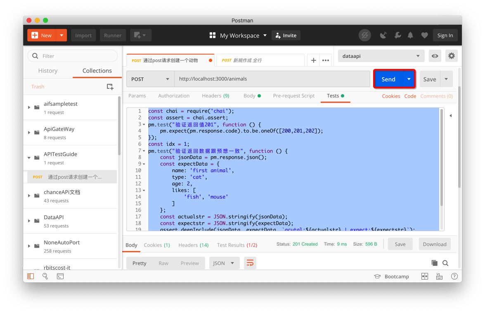

everything looks fine
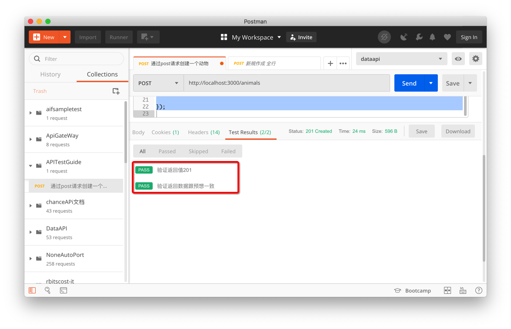

至此第一个请求完成，接下来我们补充全局变量的用法

参考post来再创建一个新的请求"通过get请求获取创建完的动物"，此处不详细截图了，创建完如下
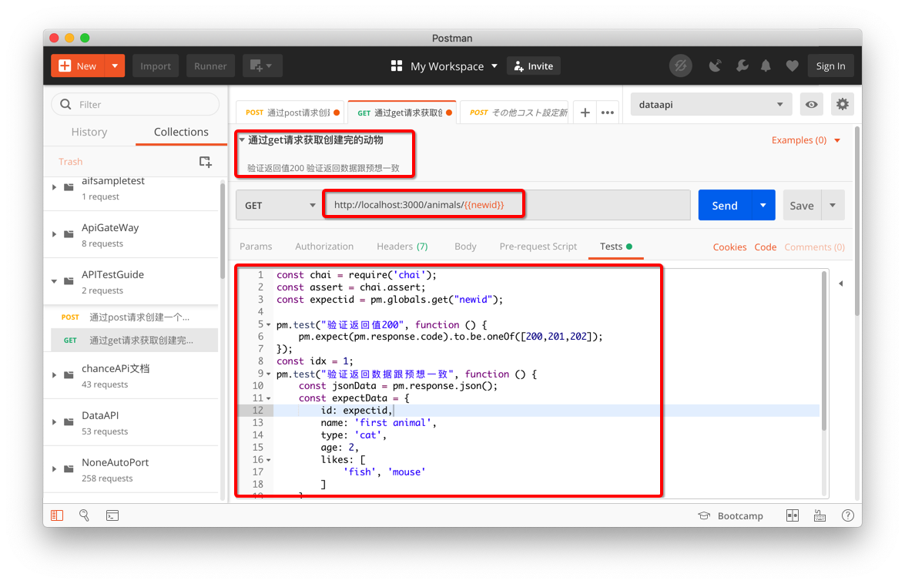

此处请求地址里用到了{{newid}},这个newid的值即为第一个post请求最后的Tests代码里设置的，创建完的id，此处通过get请求来get指定id的数据

Tests代码
```javascript
const chai = require('chai');
const assert = chai.assert;
// 从全局变量里取得newid的值
const expectid = pm.globals.get("newid");

pm.test("验证返回值200", function () {
    pm.expect(pm.response.code).to.be.oneOf([200,201,202]);
});
pm.test("验证返回数据跟预想一致", function () {
  const jsonData = pm.response.json();
  const expectData = {
    // 加入对期待值的验证
    id: expectid,
    name: 'first animal',
    type: 'cat',
    age: 2,
    likes: [
      'fish', 'mouse'
    ]
  };
  const actualstr = JSON.stringify(jsonData);
  const expectstr = JSON.stringify(expectData);
  assert.deepInclude(jsonData, expectData, `acutal:${actualstr} | expect:${expectstr}`);
});
```

try it, and again , every thing looks just fine
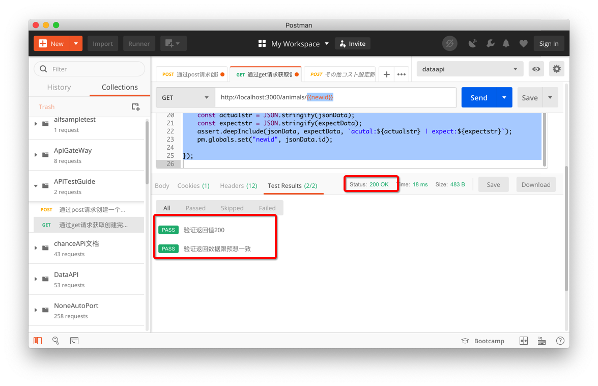

至此，所有的2个请求的手工部分都做完了

## 自动化的准备
这里我们要解决以下个关键问题，为自动化做好准备
* 分离数据:
    数据会随着应用程序的更改而做出更改，直接写在请求里会非常的不方便，也不易于维护
* 分离环境配置:
    各个测试环境会是用同样的测试用例，但是例如url等等会不同，需要能灵活的配置

手工测试的步骤里，其实把测试用例，数据，环境做到了一起，这一步我们来剥离他们。

* 分离数据:

我们希望把post请求的负载数据分离到数据文件里，并用于后面的验证步骤来用，创建一个data.json文件
```JSON
[{
  "newanimal": {
  	"name": "first animal",
  	"type": "cat",
  	"age": 2,
  	"likes": [
  		"fish", "mouse"
  	]
  }
}]
```
此处添加newanimal字段，并把post请求的body复制过来放在这里

这里引入一个新的知识点"Pre-request Script",postman的执行顺序
1.  Pre-request Script
2.  发送http请求
3.  Tests

由于Tests的脚本会在请求后做，一般我们会把验证都放在Tests里，Pre-request Script会在执行请求前做，我们用于数据的准备，就比如现在的情况，我们需要从data.json读取post请求需要的body数据来发送请求。

打开post请求，添加Pre-request Script代码
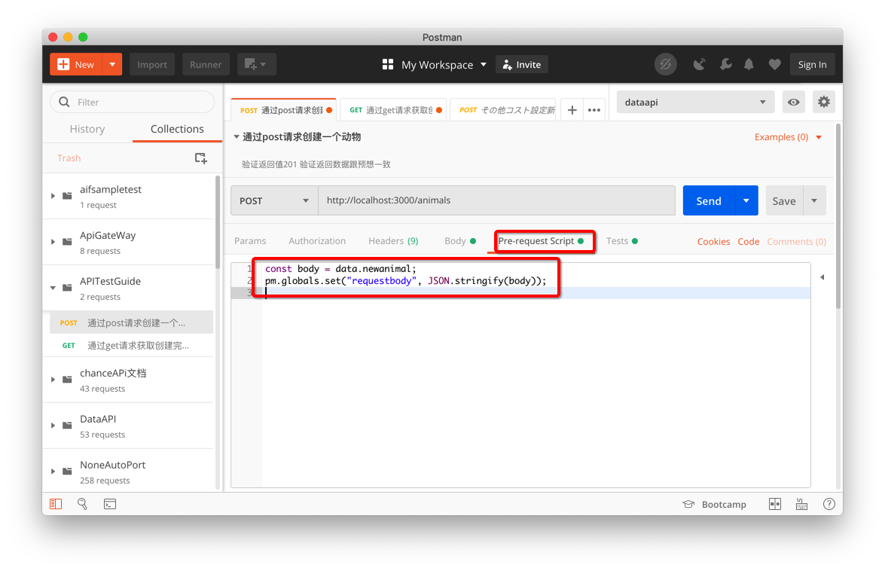

Pre-request Script代码
```javascript
// 把数据文件里的newanimal字段读出来，并保存在body变量，此处data为固定名字，由postman创建，更改无效
const body = data.newanimal;
// 把body变量转换成字符串后设置到全局变量requestbody里
pm.globals.set("requestbody", JSON.stringify(body));
```

更改请求的body内容
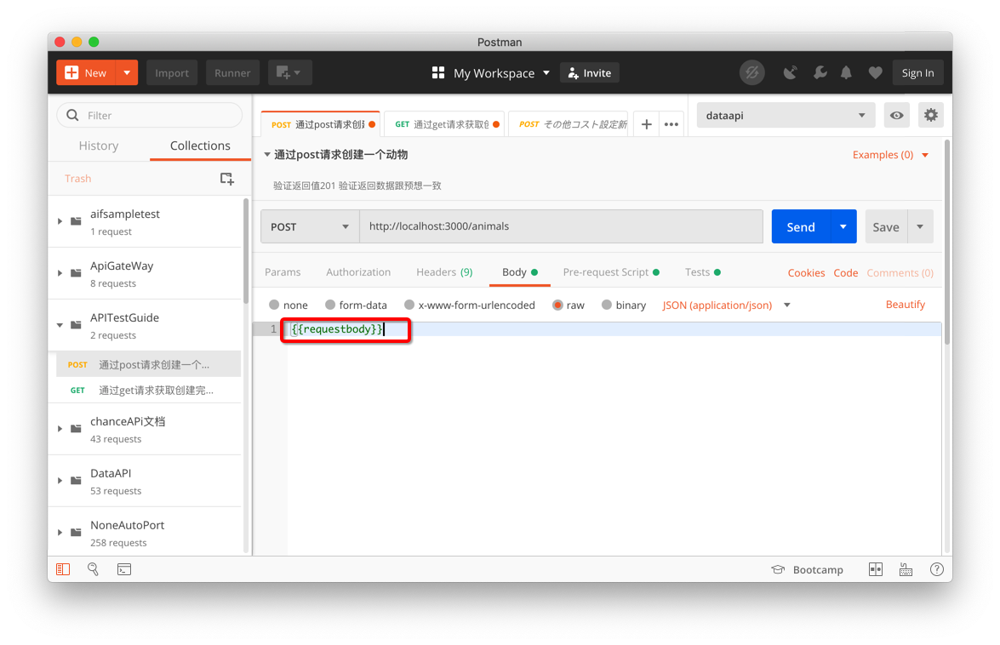

更改Tests代码
```javascript
const chai = require('chai');
const assert = chai.assert;
pm.test("验证返回值201", function () {
    pm.expect(pm.response.code).to.be.oneOf([200,201,202]);
});
pm.test("验证返回数据跟预想一致", function () {
  const jsonData = pm.response.json();
  // 预想值部分从data文件中读取
  const expectData = data.newanimal;
  const actualstr = JSON.stringify(jsonData);
  const expectstr = JSON.stringify(expectData);
  assert.deepInclude(jsonData, expectData, `acutal:${actualstr} | expect:${expectstr}`);
  pm.globals.set("newid", jsonData.id);
});
```

同理修改get请求的Tests代码
```javascript
const chai = require('chai');
const assert = chai.assert;
const expectid = pm.globals.get("newid");

pm.test("验证返回值200", function () {
    pm.expect(pm.response.code).to.be.oneOf([200,201,202]);
});
pm.test("验证返回数据跟预想一致", function () {
    const jsonData = pm.response.json();
    // 预想值部分从data文件中读取
    const expectData = data.newanimal;
    // 预想值中没有id字段，我们需要对id做验证，添加id
    expectData.id = expectid;
    const actualstr = JSON.stringify(jsonData);
    const expectstr = JSON.stringify(expectData);
    assert.deepInclude(jsonData, expectData, `acutal:${actualstr} | expect:${expectstr}`);
    pm.globals.set("newid", jsonData.id);
});
```
至此我们的测试代码里已经没有数据了，测试代码基本是一次成型无需修改，测试数据可以按需修改

当用到外部数据文件时，就不能通过send按钮来发起请求了，我们需要使用postman的Collection Runner
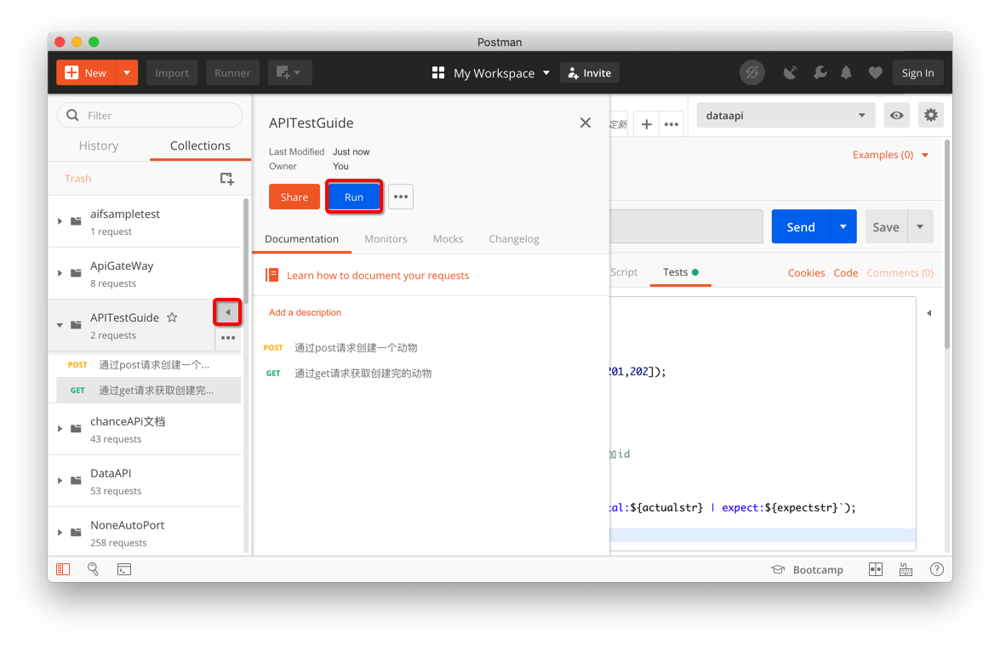
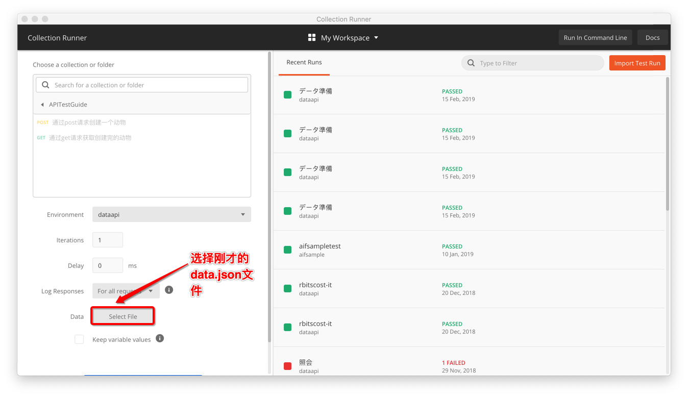
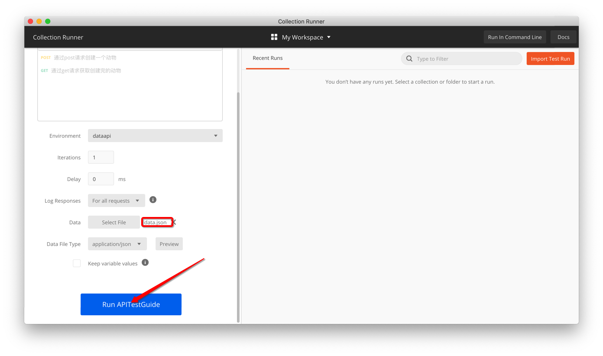

一如既往的稳
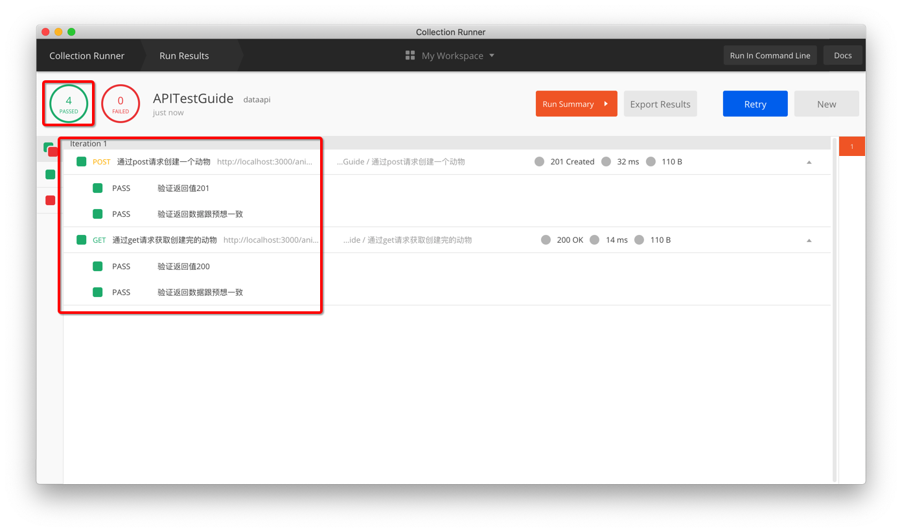

* 分离环境:

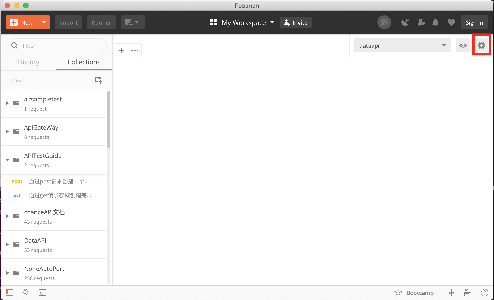
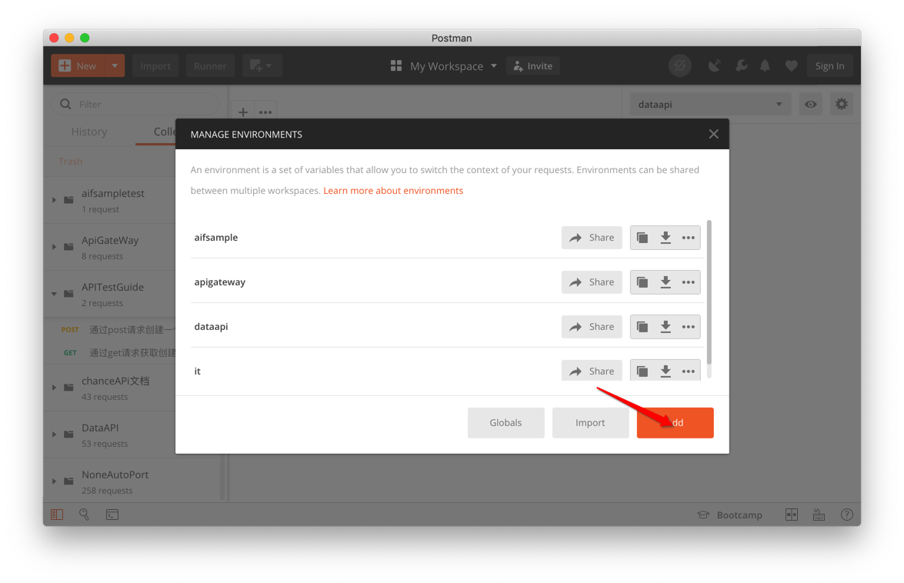
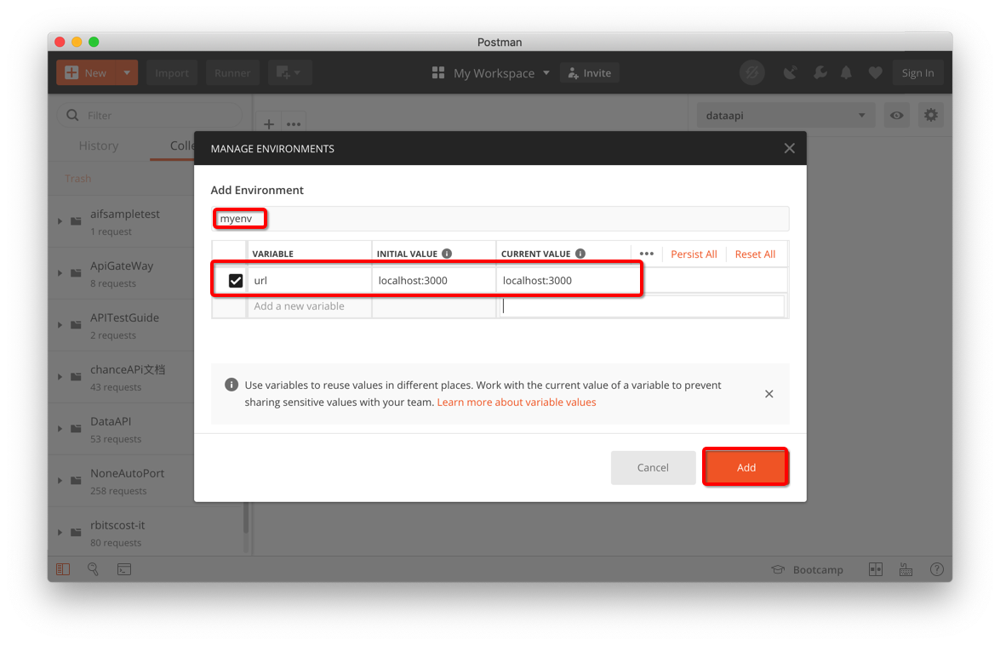

打开请求，修改原来请求中固定的url为环境变量
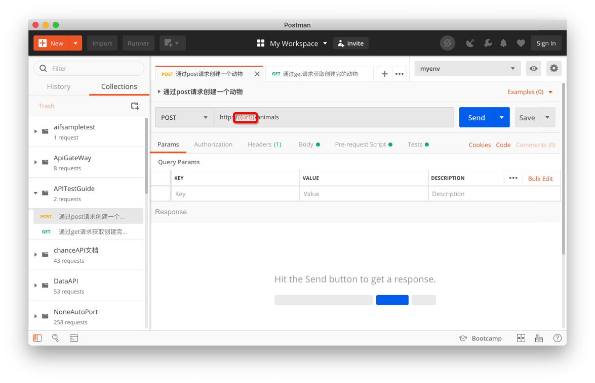

just do it
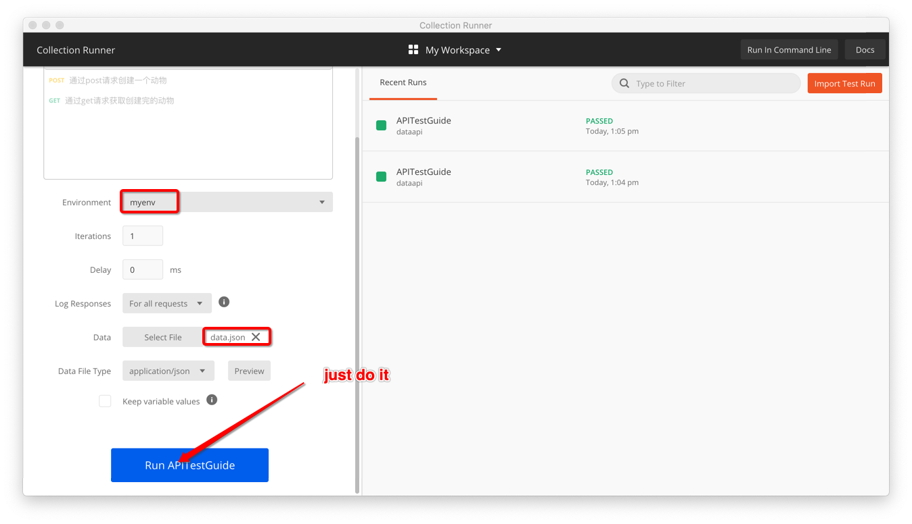

everything is so fucking fine
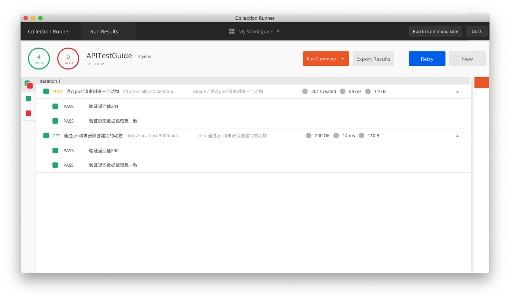

## 进行自动化测试
导出测试case
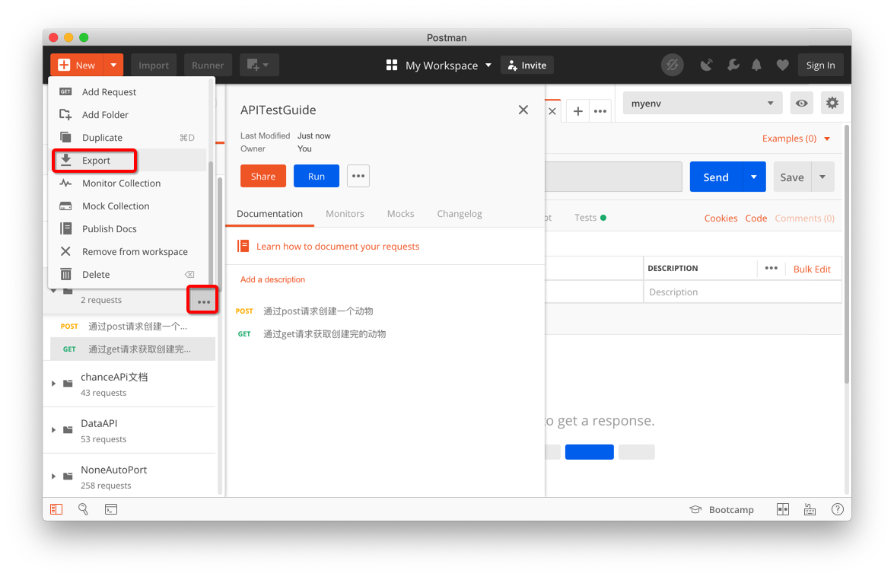
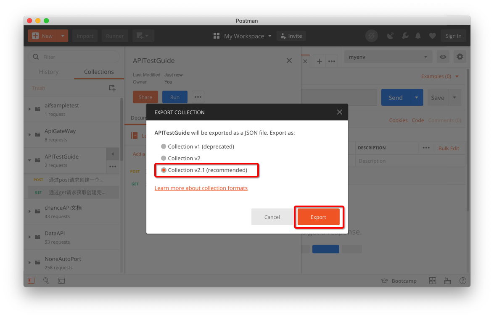

导出后为json文件，可以作为代码的一部分保存到代码仓库，其他开发人员可以在postman导入这个json文件进行编辑

导出环境配置

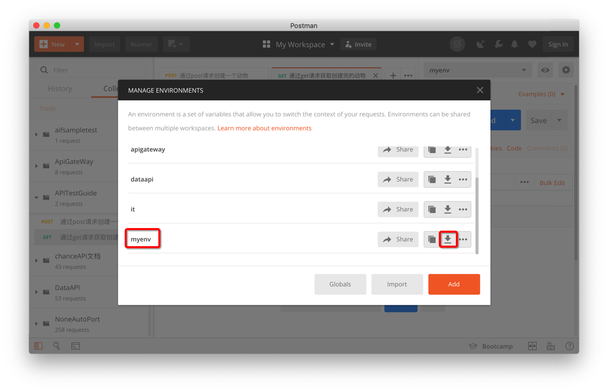

导出后也是json格式，打开一看应该就能明白，根据环境不同修改值即可

至此我们已经完成了3个主要的输入文件，测试case，数据，环境,这些文件都可以在sample目录下找到，这里补充上report模板mytemplat.hbs,如果需要定制，请自行编辑

在命令行终端，cd到你存放上述文件的目录中断执行下面命令，执行完毕后，可以打开testreport.html看报告
```
newman run APITestGuide.postman_collection.json \
-d data.json \
-r html --reporter-html-export testreport.html \
--reporter-html-template mytemplat.hbs \
--environment myenv.postman_environment.json
```
命令说明
* APITestGuide.postman_collection.json 

  指定测试case文件为，APITestGuide.postman_collection.json 
* -d data.json 
  
  指定数据文件
* -r html --reporter-html-export testreport.html

  指定report格式为html，输出到testreport.html

* --reporter-html-template mytemplat.hbs

  指定report模板为mytemplat.hbs

* --environment myenv.postman_environment.json

  指定环境配置文件为myenv.postman_environment.json

## 文件上传
文件上传的请求，postman是不能正常导出的，上传的文件的信息会丢失，我们需要再DESCRIPTION字段留下文件名信息供自动化测试使用
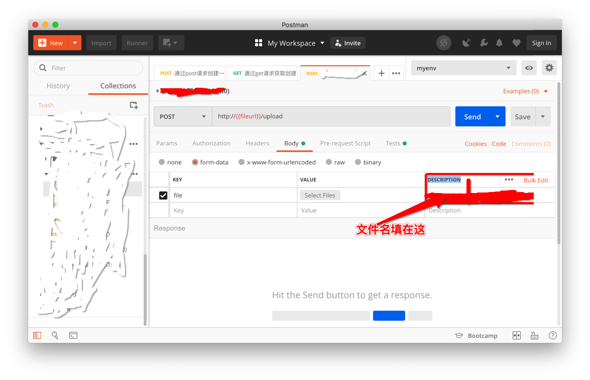
在导出json文件后进行一次变换，变换需要用到[cic工具包](https://www.npmjs.com/package/@cic-digital/cic-tool-kit)

安装
```
  npm install -g @cic-digital/cic-tool-kit
```

变换
```
  ctk editpostman --input=导出的json文件 --output=变换后的文件名
```

## Debug
打开控制台
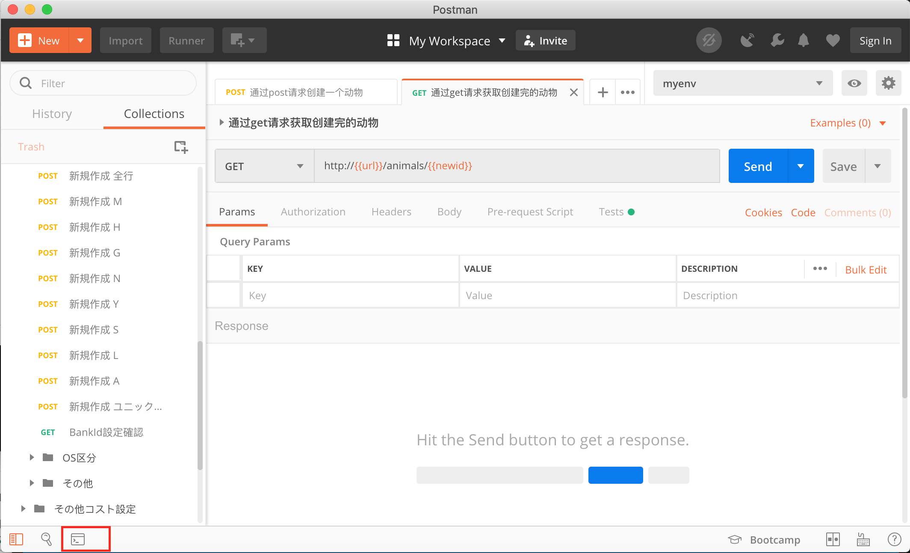

代码中添加console.log来输出需要的检查的变量到控制台
```javascript
console.log(xxx)
```

##  最后
希望你看完已经完全掌握api自动化测试，有问题联系wuhd@cn.ibm.com
