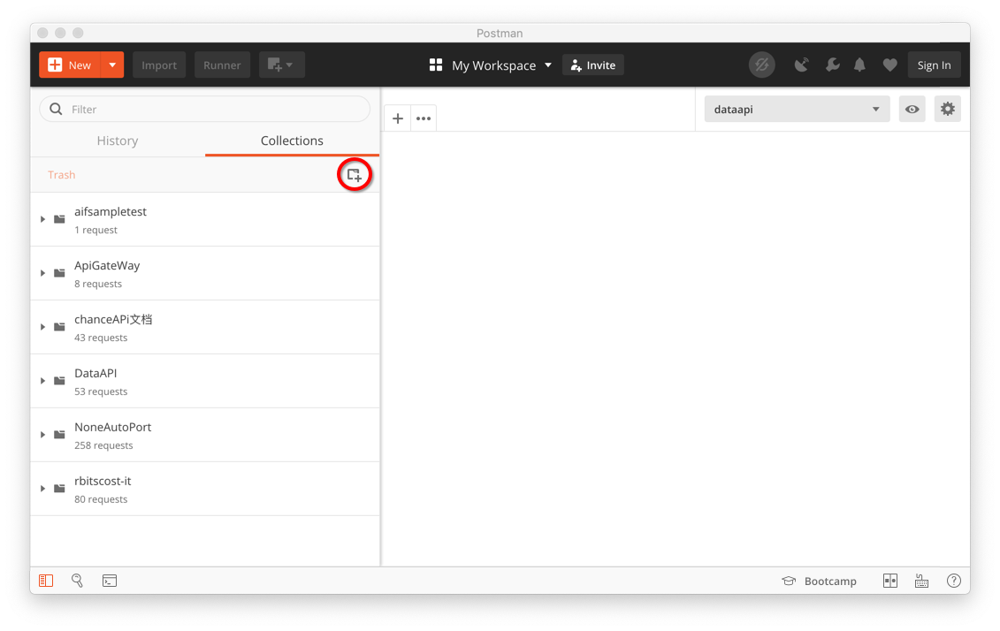

# APITestGuide
手把手教会你做API自动化测试，你需要有一点点扣腚经验，至少保证能准确的ctrl+c ctrl+v

## 环境配置
- 下载安装
  * [Postman](https://www.getpostman.com/downloads/)
  * [Node.js](https://nodejs.org/en/)

- 命令行安装
  * newman
  ```
  npm install -g newman
  ```
  * jsonserver(非必须，本教程用做API服务器的mock，用法很多，自行[参考](https://github.com/typicode/json-server)
)
  ```
  npm install -g json-server
  ```

## 创建模拟被测环境
找到一个空目录(参考sample目录)，创建一个db.json的文件
```json
{
  "animals": [
  ]
}
```

启动模拟环境
```
json-server --watch db.json
```

## 教程说明
本教程会通过下面4个API请求，覆盖大部分用法
- 通过post请求创建一个动物
- 通过get获取所有的动物
- 通过get请求获取创建完的动物
- 通过delete请求删除既有的东西

自动化测试的执行需要3个主要输入文件
- 测试用例
- 测试数据
- 环境配置

本教程会教会你怎么创建并使用这3个文件

当然，报告也是必不可少的，如何生成报告也会在本教程中被覆盖

## 使用postman进行手工测试
自动化测试只是把手工测试的步骤自动化执行，so第一步，我们先来手工做一遍

打开postman，创建一个collection

